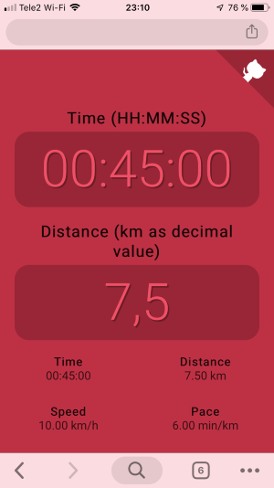

# Pace Calculator

A small ReactJS application to calculate speed and pace based on time and
distance.

Demo can be found at [sawert.se/pace](https://sawert.se/pace).

Nice looking layout with mobile support by
[@jhornsten](https://github.com/jhornsten).




## Styling

The stylesheet is written in [SCSS](https://sass-lang.com/) and needs to be
built too `src/index.css`. Use your favorite `sass` tool and build.

```sh
sass --no-source-map src/scss/main.scss src/index.css
```
