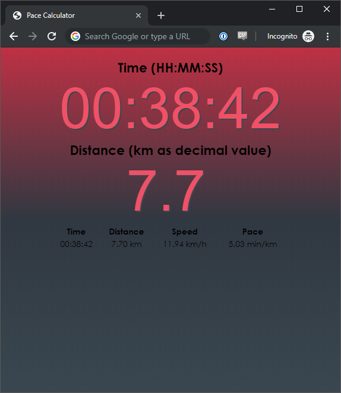

# Pace Calculator

> [!TIP]
> Check out
> [bombsimon/better-pace-calculator](https://github.com/bombsimon/better-pace-calculator)
> instead!

A small ReactJS application to calculate speed and pace based on time and
distance.

Demo can be found at [pace-calc.nu](https://pace-calc.nu).

Nice looking layout with mobile support by
[@jhornsten](https://github.com/jhornsten).



## Development

Tested under `node` v20. Install all dependencies:

```sh
npm install -D
npm run dev
```

## Deploying

To host under GitHub pages

```sh
npm run build
npm run deploy
```
