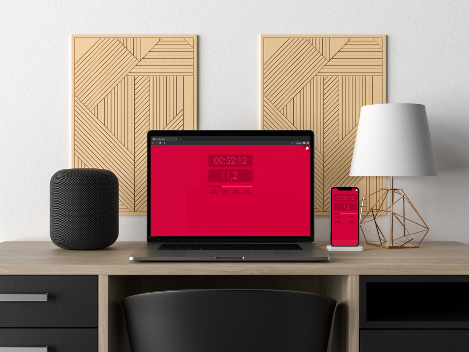

# Pace Calculator

A small ReactJS application to calculate speed and pace based on time and
distance.

Demo can be found at [pace-calc.nu](https://pace-calc.nu).

Nice looking layout with mobile support by
[@jhornsten](https://github.com/jhornsten).



## Styling

The stylesheet is written in [SCSS](https://sass-lang.com/) and needs to be
built too `src/index.css`. Use your favorite `sass` tool and build.

```sh
sass --no-source-map src/scss/main.scss src/index.css
```

## Hosting

Just symlink Nginx config to your Nginx installation. Ensure certificates
exsist.

```sh
sudo ln -s /opt/www/pace-calculator/nginx.conf /etc/nginx/sites-enabled/pace-calc.nu
```

### Google Cloud Run

```sh
# Build and push Docker image
$ gcloud builds submit \
  --tag gcr.io/zippy-cab-252712/pace-calculator

# Deploy
$ gcloud beta run deploy \
  --image gcr.io/zippy-cab-252712/pace-calculator \
  --platform managed
